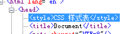
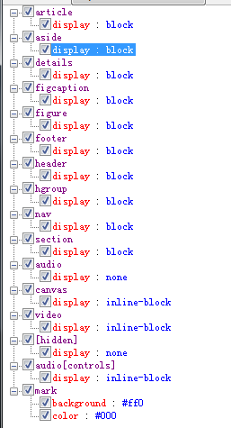
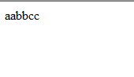
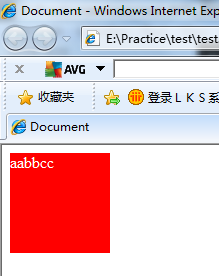

发布时间  @2017.12.01  
博客链接:
>[https://blog.csdn.net/qq_33207773/article/details/78688193](https://blog.csdn.net/qq_33207773/article/details/78688193)
>

## h5shiv.js实现原理及代码学习 ##

####html方面主要是学习了H5的一些标签和属性的运用，因为要兼容IE8，所以采用的比较少，然后兼容是使用h5shiv.js这个库来实现的。稍微了解了一下h5shiv的工作机制####  
  

参考连接 [https://www.xxling.com/blog/article/41.aspx](https://www.xxling.com/blog/article/41.aspx)  
源码链接 [https://github.com/aFarkas/html5shiv/blob/master/src/html5shiv.js](https://github.com/aFarkas/html5shiv/blob/master/src/html5shiv.js)      

源码注释非常的多（和代码量差不多，源码总共才300行，空行和注释大概有一大半），写的逻辑也很清晰，这种代码风格可以学习一下。
  
1.首先是如何检测浏览器是否支持HTML5标签的样式，通过创建一个标签，然后检测标签中是否有html5的新属性（源码用的是a标签的hidden属性）("hidden" in a)若为true则说明支持，否则不支持。  
2.然后是如何检测浏览器是否支持Html5标签，通过向刚才创建的a标签里添加一个自定义子标签，通过a.childNodes.length来判断  IE8及以下返回为0，其余为1
3.最后通过对document.creatDocumentFragement方法中的三个属性cloneNode createDocumentFragment createElement 来判断是否支持html5标签。  

- 检测完毕后 如果不支持html5标签样式则向&lt;head&gt;标签里添加H5的css样式。如下图所示，可以看到IE8里head里被插入了一个样式表。这个样式表是为了初始化h5的样式，因为h5标签默认为内联标签  

- 如果不支持html5标签则通过document.creatElement来一一创建一次h5的标签。只要在document里创建过一次对象后，后续的样式就能正常的应用在h5标签上了。为了验证这一过程，做个简单的实验  
	代码：
	<body>
	 	&lt;xyz&gt;aabbcc&lt;/xyz&gt;
	</body>
	样式：
	&lt;style type="text/css"&gt;
        xyz{
            display:block;
            height:100px;
            width: 100px;
            background-color: red;
            color:#fff;
        }
    &lt;/style&gt;
IE8下显示效果：  
  
  
添加script ：  
	document.creatElement("&lt;xyz&gt;&lt;/xyz&gt;");
IE8下显示效果：  

  
  

- 知识点1 documentFragment，在平时经常会遇到循环里往某个节点一直添加新的节点的情况 e.g:    
	for(var i = 0;i < 10;i++){  
	  var node = document.creatElement("&lt;a&gt;&lt;/a&gt;");
	  document.body.append(node);  
	}
这样的情况下每次append都会引起整个页面的回流，消耗性能巨大。改写成如下情况。
	var d = document.createDocumentFragment();  
	for(var i = 0;i < 10;i++){  
	  var node = document.creatElement("&lt;a&gt;&lt;/a&gt;");  
	  d.append(node);  
	}  
	document.body.append(d);  
这样写则只会引起一次回流，就是append(d)的时候。可以把documentFragement理解成在document里的缓存碎片节点。

 
- 知识点2 Function()与eval()    
Function是类实例的封装对象，类似于String之于string。    
Function()可以通过 Function(arg1,arg2,...,argn,执行体);的结构构造一个函数，其中执行体为字符串，执行方式同eval，但是性能会比eval高很多，所以推荐使用Function()替代,而且Function中新var出来的变量在局部作用域中，不会造成全局污染。当然两者的可读性都不是很好，能不用最好不用。

- 知识点3 h5shiv.js的写法  代码风格  
通过闭包(function(window,document){
})(window,document); 的方式将内容全部封装到一个立即执行函数里，然后通过window.html5 = html5 的方式将内部接口暴露出来。能避免全局污染，同jquery暴露出来的只有$和jQuery两个对象。  
整个函数的结构为  
(function(window,document){  
   part 1 : 变量声明；  
   part 2 : 检查H5支持情况 ，  立即执行函数  
   part 3 : 功能函数  
   part 4 : 暴露接口  
   part 5 : 函数入口	
})(window,document);  

